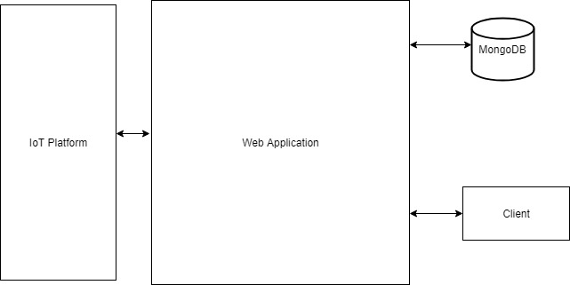
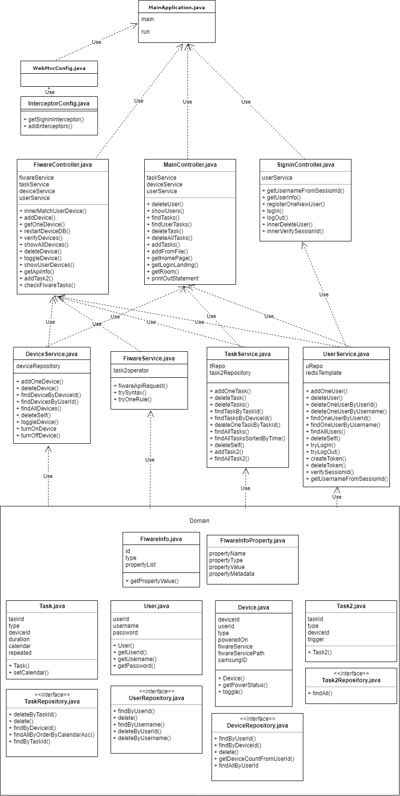

# OO Design and UML

The high level diagram shows a very abstracted overview of how our product works.

Client: User’s device that is communicating with the web application with HTTP, sending requests, and receiving smart home data.

Web Application: Our web application is the middle man, this takes the client’s requests, uses JSON commands to interact with the database, computes whatever data the client is requesting and sends back to the client.

MongoDB: NoSQL database that we are using to store our user and device data.

IoT Platform: We send device data to the IoT platform, we do not interact with it further.

# UML Class Diagram

This diagram shows all of the classes we have made and how they are used together to show how our program works as a whole. We have included all attributes and methods. As you can see, the program works by 3 main controllers, FiWareController, MainController and SignInController. FiWareController uses DeviceService, FiWareService, TaskService and UserService as all of their methods and attributes are needed to control the FiWare. MainController uses TaskService, UserService and DeviceService, as those 3 are the ones needed to display the necessary information to the user, for example which tasks they have scheduled, or to view their user/device data. SignInController only requires UserService, as it only needs the user's username, password and session data. Each of these services draw from the base classes: User, Device, Task, Task2, FiWareInfo, each with their respective repository. These base classes are instantiated and represent what their name is. For example, Task stores task data relevant to one specific task; ID, duration, calendar etc.

# Architecture Diagram

This diagram demonstrates how the different components of our architecture work together in order to create the user experience. The user interacts with the front end and their local browser storage, in order to allow storage of the cookies. The front end makes POST requests to the middleware, and then takes the response. The responses are stored within the webpage and worked into the HTML to create a dynamic webpage.

The middleware is connected to the server application and is able to take advantage of Spring Boot's auto-wiring. The MongoDB server is currently hosted locally but could be easily changed using the config. We do not handle the FiWare server but our server application has the ability to send information to it as needed.
