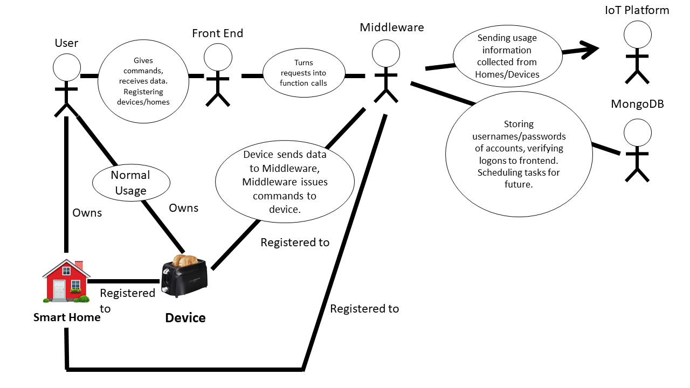

# Alex Mavromatis
Alex works as a research associate for the high performance network group at University of Bristol. He proposed the initial project and has been our guide for both a general outline of the project and what technical elements should be utilised (eg. he informed us that we should use MongoDB for this project). He is our main client for this project, and we have been continually consulting with him to ensure a successful project is completed to his design. Alex has an investment not only in a good project being made but the data being collected properly such that it can be utilised for research.

# Theo Tryfonas
Theo is a reader in Smart Cities in the department of Civil Engineering. His research focuses both on Smart Cities and the IoT. He also proposed the initial project and though we have not met with him as frequently as we have met with Alex, his insights and ideas have been incredibly useful in helping us to start the project. Theo also has an investment not only in a good project being made but the data being collected properly such that it can be utilised for research.

# Samsung
Since many of the devices used within the Smart Homes are Samsung, it is incredibly important our middleware is created in such a way that properly looks after Samsung usage data. Not only are we collecting data, we are offering remote functionality to the devices that makes them even more useful - but we need to be careful with security and ensure the IoT data is sent correctly.

# University of Bristol
Both of our clients we have been meeting with are members of Research Groups at the UoB, so we have a responsibility to them through our clients.

# Smart Home Owners
Smart Home owners rely on us building a functional piece of software with a simple to understand and easy to use front end. They rely on the consistency of our software to allow them to plan around it - they can take full advantage of our software if it is always available. Furthermore, they also put trust in us to take care of their data properly - storing passwords and identifying information securely and ensuring that only they have control over Smart Devices in their home. 

# Use Case Diagram

# Main Goal:

The collection of data and control of Smart Home Devices through a middleware, with a front end available to the user.

# Smaller Goal - Data Collection:

1.  Data relating to usage (how often is the device on, what times is it normally on) should be able to be collected from the devices - either calculated by the device or by our middleware.

2. Other important data, such as usernames and passwords for user accounts and device IDS should be assigned by our middleware or the device itself.

3. Depending on the data, it should either be sent through the middleware to either an IoT platform hosted by FiWare (encoded in such a way it can be received by that platform) or entered into our MongoDB database.

4. Sufficient care must be taken with any identifying device information, or any sensitive information such as passwords. Sufficient care may mean salting, encrypting or any other security procedure to protect the users of our middleware.

# Smaller Goal - Device Control:

1. Using our front end, a user should be able to view all devices attached to their Smart Home (and only devices attached to their smart home). They should be able to view information such as Device ID’s, remove devices from their account and add others - with sufficient security measures to ensure they are only adding devices in their home.

2. The front end should have a username and password system, stored securely on a database with security measures to protect user passwords as defined under part 4) of Data Collection.

3. Devices should have the ability to have operations performed on them depending on the device. Certain devices should be able to turned on or off, or perform certain tasks immediately - eg. lowering power on Smart Toaster.

4. Our middleware should also allow for tasks to be queued and performed at a set time. This should not require any further interaction after the task is scheduled. Queued tasks should be able to be cancelled and modified at any time before they are carried out. Eg. Queing up smart oven to start preheating at 20:00.
