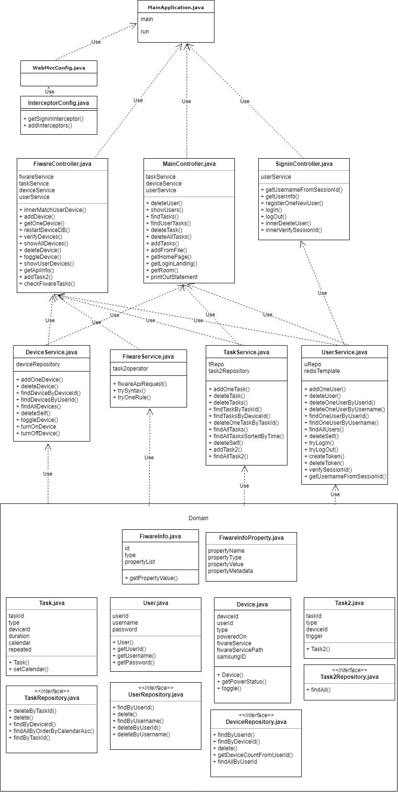

# Project
We have been working on a Smart Homes Application, able to manage and control multiple devices attached to multiple homes. These devices can have tasks scheduled, recurring tasks set up and can be controlled manually through a user dashboard. Our software is also able to connect to FiWare, an IoT platform allowing for more control of the devices and more potential uses of
our program.

# Client
Our client is Alex Mavromatis, a Senior Research Associate at the High Performance Network group. We have been working closely with Alex over the project, gaining valuable insight into smart devices and homes and how our project would work. We have created the project with Alex's guidance, regularly meeting with him and his feedback has been an instrumental part of the development process.

# Problem
The main problem we are trying to solve is creating flexible middleware that can be used on as many devices as possible. Different smart devices can have different ways of being controlled, and most people have a range of brands of device but don't want to use multiple applications in order to control them. We have tried to create a very modular project, such that support for new devices can be added easily without causing any problems. We also wanted to make sure the project had a simple front end, and could just be used from a web browser rather than requiring the user to install an application.

Smart Homes are a growing market. 81% of Americans favour homes with smart features, and 62% claim security systems are the top benefit. People want a simple way to interact with these devices - 72% want a home with voice capabilities. Household penetration was 7.5% in 2018 and is expected to hit 19.5% by 2022 - a large increase. The need for a simple easy and accessible smart interface is clear.

# Consideration
The most important part of our project in terms of sustainability is ensuring it can be easily updated. It would be foolish to assume that the landscape of Smart Devices will not change in the next 6 months,
let alone the next few years. Our project handles devices, tasks and even cookies entirely in it's own databases - ensuring continuing functionality is not contingent on outside software or databases.

# Requiements
There are a variety of stakeholders with different levels of investment and different expectations from our project. They engage with the project in different ways and understanding their requirements and expectations is pivotal to building a solid project.
## Clients
### Alex Mavromatis
Alex works as a research associate for the high performance network group at University of Bristol. He proposed the initial project and we have met with him regularly. He has been our guide for both a general outline of the project and what technical elements should be utilised.
### Theo Tryfonas
Theo is a leader in Smart Cities in the department of Civil Engineering. His research focuses both on Smart Cities and the IoT. He also proposed the initial project and though we have not met with him as frequently as we have met with Alex, his insights and ideas have been incredibly useful in helping us to start the project.
### Samsung
Samsung is one of the market leaders in terms of smart technology. Many of the devices in the Smart Project Lab are Samsung and it is incredibly important our middleware is created in such a way that properly looks after Samsung usage data.
### University of Bristol
Both of our clients we have been meeting with are members of Research Groups at the University, so we have a responsibility to them through our clients. Many of the devices we test on are owned by the University, so we need to ensured information is stored correctly.
## End-Users
### Smart Home Owners
Smart Home owners rely on us building a functional piece of software with a simple to understand and easy to use front end. They rely on the consistency of our software to allow them to plan around it - they can take full advantage of our software if it is always available. Misuse of smart devices could also potentially pose a safety hazard, especially if the devices involved are security devices.

## Use Case Diagram

A client may interact with the project very differently to a user. We have designed the project to work on two levels, so a user can interact with it but the client can change features and expand the usefulness to specific devices. An example of this would be the devices we were initially given. These were sensors, specific to research to measure humidity. This would be less useful to a user, but the features to turn off above a certain humidity are near identical to the logic an oven would use to turn off at a certain temperature.

## Goals
### Data collection

1) Data relating to usage (how often is the device on, what times is it normally on) should be able to be collected from the devices - either calculated by the device or by our middleware depending on the data. Also the data can be collected directly by user manually type in when using the web application. The data being collected and stored should be visible to the user, as should where it is being sent.

2) Other important data such as usernames and passwords for user accounts should be stored securely to make sure only the user in the current session can impact their own devices. Data such as device and user ids should be generated by the middleware.

3) Depending on the data, it should either be sent through the middleware to either an IoT platform hosted by FiWare (encoded in such a way it can be received by that platform) or entered into our MongoDB database.

4) Sufficient care must be taken with any identifying device information, or any sensitive information such as passwords. Sufficient care may mean salting, encrypting or any other security procedure to protect the users of our middleware.

Alternatives: If the client wishes to change the system to collect a piece of information not currently being stored, they can expand and adapt the functions we have provided in order to allow for collection of this data.

Exceptional: If the client wishes to collect data that is not able to be collected (either the information is not available and cannot be calculated, or cannot be stored for privacy reasons) our program will not be able to facilitate this collection.

### Device Control:

1) Using our front end, a user should be able to view all devices attached to their Smart Home (and only devices attached to their smart home). They should be able to view information such as Device ID’s, names and associated tasks. They should be able to remove devices from their account and add others with sufficient security measures to ensure they are only adding devices in their home. Depending on the situation in which our middleware is being used, we may need to ensure the device is linked to a real device. This option could be available, but currently devices can be added by name only.

3) Devices should have the ability to have operations performed on them depending on the device. Certain devices should be able to turned on or off, or perform certain tasks immediately - eg. lowering power on Smart Toaster. These should vary by the device. Turning on/off is the only universal task and can be manually done by users.

4) Our middleware should also allow for tasks to be queued and performed at a set time. This should not require any further interaction after the task is scheduled. Queued tasks should be able to be cancelled and modified at any time before they are carried out. Eg. Queuing up smart oven to start preheating at 20:00. These can repeat after set intervals.

Alternative: If the task is unable to be completed (it is disconnected from the network or not functioning), the program will wait for confirmation from the device to update its state. For example, if someone attempts to turn a device on and it is not responding the act of issuing the "Turn On" command will not be enough to change it from the users perspective. It will only change once there is confirmation from the device.

Exceptional: If a Task is created with illegal syntax, the program will disregard it and will not attempt to apply the incorrect syntax.

### Proper Front end

1) The front end should have a username and password system, stored securely on a database with security measures to protect user passwords as defined under part 4) of Data Collection. Upon login with correct details, the user should be provided a cookie with a unique session key. These cookies should only last a certain amount of time, but whilst active should allow the user to access their page without needing to verify their identity on every page.

2) The UI should be clear and easy to navigate, with unambiguous options and a logical flow. This is difficult to properly assess, and will likely require and interview to get an idea of how well it actually works. It is important that this is accessible as the aim is for it to be available to Smart Home customers - not just experts.

Alternative: If a cookie expires, the user is required to sign back in and they will not be able to access the dashboard if they fail to.

Exceptional: If there are issues in connecting to the middleware, the front end will not fully load and the user will not be able to submit commands. If any commands are issued, the functions in the backend verify the information is correct. If the initial functions have not properly completed, the functions issued will be invalid and will be detected by the backend.

### Front end and middleware interaction

1) The user uses buttons, fields and forms to interact with the front end. When certain buttons are clicked, these are translated into post requests - using the information given in fields and forms. For fields, these are checked to make sure they haven't been left blank.

2)- This request is sent to a URI. The Front End has performed checks on certain piece of data, and others are covered by the function. This is because some things can be checked (is a id valid?) but others cannot (typos in device names). If the request passes error checking, it then performs a set of interactions with the database depending on the URI.

Alternative: If any of the error checking fails, the request is stopped. If it fails in the front end, the request never even happens. If it fails in the function, it responds with a bad response and doesn't perform the database operations.

Exceptional: If the user enters an incorrect name for the device, they will have to delete it and re-enter it. There is no way for our system to detect mistakes in device names.

### Key Goal: Creating a device and tasks

1. User signs up or logs in to their accounts
2. User navigates to the "My Devices" page by either the side menu or clicking on "My Devices"
3. User selects "Add Device", causing the form to appear
4. User enters device name
5. User submits
(Alternative: If Step 4 was not done, return to Step 3)
6. Page reloads, user clicks on their new devices
7. User selects "Add Task 1"
8. User selects task, time and how often it should repeat
9. A POST request is made to the backend, which checks the parameters provided.
(Alternative: If parameters are incorrect, bad response issued and nothing happens)
10. New task is added to databases
11. Page reloads and user can view their new task and device, with the options to delete either or manually toggle device

### Requirements
## Functional requirements
# User
1. A user should be able to register with a unique username and a password
2. A registered user should be able to sign in with the correct username and password
3. Upon sign in or signing up the user should be issued a cookie containing a session token
4. The aforementioned session token should be stored by the program and allow the user continuing access without needing to sign in
5. Upon deletion, all the users associated devices and tasks should be deleted
# Devices
1. A user should be able to add a device to their project
2. Functionality should vary by device, but a default device will be able to turned on and off manually.
3. Devices should be able to be deleted, and upon deletion all associated tasks should be deleted.
4. The user should be able to view all information about a device on the Single Device page
# Tasks
1. The user should be able to add tasks to any devices
2. Tasks should be able to be deleted
3. When it is a tasks time to be executed, it should perform the associated instruction.
4. If the task is set to repeat, it should create a new task with a new time. If not, it should delete the task.
## Non functional Requirements
1. The program should take no more than 5 seconds to load any page
2. The program should be created in such a way it is scalable and has no hard limit on devices or tasks
3. The program should be reliable. All functions should be checked in such a way that the user cannot accidentally crash the program.
4. The program should be designed in such a way our client is able to change it so it can handle other devices and tasks.

# OO Design and UML

The high level diagram shows a very abstracted overview of how our product works.

Client: User’s device that is communicating with the web application with HTTP, sending requests, and receiving smart home data.

Web Application: Our web application is the middle man, this takes the client’s requests, uses JSON commands to interact with the database, computes whatever data the client is requesting and sends back to the client.

MongoDB: NoSQL database that we are using to store our user and device data.

IoT Platform: We send device data to the IoT platform, we do not interact with it further.

# UML Class Diagram

This diagram shows all of the classes we have made and how they are used together to show how our program works as a whole. We have included all attributes and methods. As you can see, the program works by 3 main controllers, FiWareController, MainController and SignInController. FiWareController uses DeviceService, FiWareService, TaskService and UserService as all of their methods and attributes are needed to control the FiWare. MainController uses TaskService, UserService and DeviceService, as those 3 are the ones needed to display the necessary information to the user, for example which tasks they have scheduled, or to view their user/device data. SignInController only requires UserService, as it only needs the user's username, password and session data. Each of these services draw from the base classes: User, Device, Task, Task2, FiWareInfo, each with their respective repository. These base classes are instantiated and represent what their name is. For example, Task stores task data relevant to one specific task; ID, duration, calendar etc.

# Architecture Diagram

This diagram demonstrates how the different components of our architecture work together in order to create the user experience. The user interacts with the front end and their local browser storage, in order to allow storage of the cookies. The front end makes POST requests to the middleware, and then takes the response. The responses are stored within the webpage and worked into the HTML to create a dynamic webpage.

The middleware is connected to the server application and is able to take advantage of Spring Boot's auto-wiring. The MongoDB server is currently hosted locally but could be easily changed using the config. We do not handle the FiWare server but our server application has the ability to send information to it as needed.

## Unit Test Description

Project Name: Smart Home Application

Testing Tools: JUnit with Spring Boot, MockMVC

Document Date: 30/4/2019

## Testing Plan Scope

### User-Access Tests

|Function|Description|
|---|---|
|signUpUser|Sign up a user to Smart Home Server|
|signUpDuplicateUser|Input username has been ocupied by other user while signing up|
|signInEmptyUser|Try signing in using a user which never exist|
|signInWrongPassword|Sign in with incorrect password|
|signInCorrectUser|Sign in using the info regestered previously|
|checkValidSessionId|verify the sessionId received from the server, which will be required in nearly all apis|
|signOut|Log out the currect user|
|innerCleanUser|Remove the user's record after this test|

### Smart Device Tests

|Function|Description|
|---|---|
|addDevice|Register a smart home device to the current user|
|getDeviceId|Check the device's Id is not empty and return all accessible info|
|toggleDevice|Toggle the current device|
|checkDeviceStatus|Return updated status info about current device|
|deviceChangeType|Patch the smart home device's type|
|checkDeviceType|Return updated type info about current device|
|removeDeviceOfUser|Delete the smart home device from the user|
|checkDeviceList|Return the list containing all linked devices of a user|
|deviceOfMultipleUser|Check the correctness while multiple users are operating devices at the same time. Check the correspondence of sessionId and deviceId|
|fiwareInfo|Return the smart home monitoring info|
|innerClean_UserDevice|Remove all devices and users after this test|

### Task System Tests

|Function|Description|
|---|---|
|addTask1_instant|Register scheduled task without duration arg|
|viewTask1_instant|Return the current scheduled task list|
|invokeTask1_instance|Turn on the scheduling system and check the task status|
|addTask1_duration|Register scheduled task with duration arg|
|invokeTask1_duration|Turn on the scheduling system and add shut-down task automatically|
|deleteTask1|Delete one scheduled task which has not been invoked|
|addTask1Failure|Add a scheduled task with invalid arguments|
|multipleTask1|Add scheduled tasks and check the sorting|
|addTask2|Register monitored task for current fiware|
|viewTask2|Return the current monitored task list|
|changeTask2|Patch one specific monitored task|
|verifyChangedTask2|Return the changed monitored task|
|deleteTask2|Delete one monitored task|
|verifyDeletedTask2|Return the list of monitored tasks after deletion|
|innerClean_UserDeviceAllTasks|Remove all tasks, devices and users after this test|

## Test Cases and Results

**Passed: 34/34**

**Coverage:**(configurations, maintenance and private functions included) Classes: 83% Method: 66% Line: 59%

### User-Access Tests

|Function|Input Value|Expected|Test Result|
|---|---|---|---|
|signUpUser|name = "test_default_username" pwd = "test_default_password"|"Signed up successfully."|Passed|
|signUpDuplicateUser|name = "test_default_username" pwd = "test_default_password"|"The username has been used by another user."|Passed|
|signInEmptyUser|name = "test_empty_username" pwd = "test_empty_password"|"failed"|Passed|
|signInWrongPassword|name = "test_default_username" pwd = "test_wrong_password"|"failed"|Passed|
|signInCorrectUser|name = "test_default_username" pwd = "test_default_password"|"succeeded" Response.Cookie["sessionId"].Length > 0|Passed|
|checkValidSessionId|sessionId|sessionId != "wrong_sessionId"|Passed|
|signOut|token = sessionId|"succeeded"|Passed|
|innerCleanUser||200/OK|Passed|

### Smart Device Tests

|Function|Input Value|Expected|Test Result|
|---|---|---|---|
|addDevice|token = userSessionId type = "test_default_device_type"|200/OK|Passed|
|getDeviceId|token = userSessionId|Response.String["deviceId"].Length > 0|Passed|
|toggleDevice|token = userSessionId device = defaultDeviceId|"Device toggled"|Passed|
|checkDeviceStatus|token = userSessionId device = defaultDeviceId|Response.String["poweredOn"] == "true"|Passed|
|deviceChangeType|token = userSessionId device = defaultDeviceId input = "test_default_device_type2"|"finished"|Passed|
|checkDeviceType|token = userSessionId device = defaultDeviceId|Response.String["type"] == "test_default_device_type2"|Passed|
|removeDeviceOfUser|token = userSessionId device = defaultDeviceId|"Device deleted"|Passed|
|checkDeviceList|token = userSessionId|Response.String.Length <= 10|Passed|
|deviceOfMultipleUser|token = userSessionId device = deviceOfUser2Id|"not match"|Passed|
|fiwareInfo||200/OK|Passed|
|innerClean_UserDevice||200/OK|Passed|

### Task System Tests

|Function|Input Value|Expected|Test Result|
|---|---|---|---|
|addTask1_instant|token = userSessionId device = defaultDeviceId type = "test_default_task1_type" in = "0" duration = "0"|"Task added"|Passed|
|viewTask1_instant|token = userSessionId device = defaultDeviceId|Response.String["taskId"].Length > 0 Response.String["poweredOn"] == "false"|Passed|
|invokeTask1_instance|token = userSessionId device = defaultDeviceId task = task1Id|"not found" Response.String["poweredOn"] == "true"|Passed|
|addTask1_duration|token = userSessionId device = defaultDeviceId type = "test_default_task1_type" in = "0" duration = "5"|"Task added" Response.String["taskId"].Length > 0|Passed|
|invokeTask1_duration|token = userSessionId device = defaultDeviceId task = task1Id|"not found" Response.String["taskId"].Length > 0 && Response.String["taskId"] != task1Id Response.String["poweredOn"] == "true"|Passed|
|deleteTask1|token = userSessionId task = task1Id|"finished"|Passed|
|addTask1Failure|token = user2SessionId device = defaultDeviceId type = "test_default_task1_type" in = "0" duration = "0"|"device not belongs to the user"|Passed|
|multipleTask1|**Params1:** token = userSessionId device = defaultDeviceId type = "test_default_task1_type_late" in = "5" duration = "0" **Params2:** token = userSessionId device = defaultDeviceId type = "test_default_task1_type_early" in = "0" duration = "0"|Response.String["type"] == "test_default_task1_type_late"|Passed|
|addTask2|token = userSessionId device = defaultDeviceId type = "Toggle" condition = "[Humidity,>,0.35]"|"task2 added"|Passed|
|viewTask2|token = userSessionId device = defaultDeviceId|Response.String["taskId"].Length > 5|Passed|
|changeTask2|token = userSessionId device = defaultDeviceId taskId = task2Id type = "TurnOn" condition = "[Humidity,>,0.4]"|"finished"|Passed|
|verifyChangedTask2|token = userSessionId device = defaultDeviceId|Response.String["type"] == "TurnOn" && Response.String["trigger"] == "[Humidity,>,0.4]"|Passed|
|deleteTask2|token = userSessionId device = defaultDeviceId taskId = task2Id|"finished"|Passed|
|verifyDeletedTask2|token = userSessionId device = defaultDeviceId|Response.String.Length <= 10|Passed|
|innerClean_UserDeviceAllTasks||200/OK|Passed|

## Additional Documents

*The external apis of "fiware-service" are not included in this testing.*

# Evaluation
In order to evaluate our project properly, we considered what methods would be most effective so we could tailor them for our project. The main aim from a consumer’s perspective is to allow users to manage their devices and tasks, and data (such as electricity consumption). This meant UI would be very important. We wanted to take feedback from people so we could create a user manual, making it so no one could get confused. We also wanted to evaluate how well the project fulfilled Alex's need, of being flexible and able to be adapted for a number of devices. Finally, we wanted to evaluate how well the technical functions worked.
We decided due to these three needs; a variety of testing methods would be used. We would speak to a number of people, including our client to get some feedback on how they felt about our project. We would ask questions concerning user interface, ease of use, how bug-free their experience had been and their thoughts on it as a whole. Interviews are fantastic opportunities to get feedback live, as you can see how someone is engaging with the software. UI problems, for example, are incredibly easy to notice when someone else is using the software. The form would also mean we could ask specific questions and follow up if there were ambiguous answers - as opposed to an online survey, which could lead to some "incomplete data".
We would also implement unit testing, showing that our project worked as intended with suitable error checking and minimal side effects. We do not expect everything to be perfect, so we would like to assess ourselves and understand which parts have been done well and which could be improved a lot. Unit testing is a fantastic way to ensure the project is reliable and useful. Whilst implementing it, we realised we should have made it a significant part of our project from the start. It was always our intention to develop testing alongside our project, and this is something that unfortunately fell to the wayside.
# Interview One
I spoke to my friend Eva, in an attempt to establish what she liked about the project and try and get some valuable feedback. I did not give her any instructions, only informing her it was a project for managing Smart Homes.
The signup and login were fine. She appreciated the choice to use cookies rather than have to constantly re-enter the username and password. She noted there was no way to delete her account from the UI. She did note the different styles between the sign-up page and the actual dashboard, due to the fact they had been designed at different times. She preferred the style of the dashboard UI, saying it looked "professional". She was also a big fan of the animations, saying it gave the whole project feel easy to use and clever. She noted it was important that for Smart Devices the dashboard felt next generation. She did not there was a lot of wasted space and didn't think it would work well on phones.
She found the program immediately confusing. We realised in a lot of testing; we'd designed around the idea that the user would already have devices visible - making it clear what to click. However, upon first signup the user would have no devices registered, and the user has to click around to understand how it works.
After adding a device, the UI "came together" in her words. It was easy to navigate around and add more devices. She liked how the form grew in a natural way, rather than seeing stretched out. She liked how versatile the design was, and that we'd chosen to use HTML and CSS to have the website change rather than a drop-down form.
She found the two types of tasks very confusing, and we realised this was something that needs to be explained clearly in the user manual. I explained the difference between the two, and she found them easy enough to set up. She felt they were a little underwhelming, but as a test demonstrated the programs functionality well.
She concluded by saying the UI felt slick and well made, but the lack of actual connected features made it feel strange. However, she felt the program had a solid basis and if we were able to correctly connect it with devices it would work well. She could see the appeal in her home but ultimately said a mobile app would be the most effective way forwards: "I don't want to log on to my laptop every time I want to turn down my volume, especially when I'm carrying a smartphone with me."
#Interview One - Key points
She liked the slick and professional UI, and how each device had its own page. She expressed that we could stylize each individual page more, using CSS and animations. A mobile app was mentioned, and this is something we would develop as a long-term goal. The user experience was confusing at first, showing the need for a user manual. I noted her confusion between two types of task, she suggested merging them and making a more flexible method of creation. This is a good idea to simplify the user experience. The overall response was positive, but the need for greater functionality was vocalised.
#Client Feedback
Not just at the end, but throughout the project we were fortunate to receive detailed and useful feedback from our client. Alex was able to highlight ways in which we could grow and develop the project, and luckily saved us from spending time on features that weren't important for the final goal. Due to his technical experience, we could get unique insights on how we should approach developing the project.
#Unit Testing
There's a lot of technical elements to our project, which may potentially be used for real Smart Homes - potentially even for security devices. It is important that there are minimal side effects and every action the user can make is carefully constructed to ensure there is no way for a user to accidentally wipe their entire database.
The user is only able to interact with the database through a series of POST requests. These can return information and change the content of the databases. We carefully made a series of unit tests, which would perform these POST request and then performs tests to ensure these have been taken care of successfully.
These tests range from very simple (does signing up a user allow you to sign in at the user) to more complex edge cases. Implementing these allows us to feel confident in our functions. Users will use all functions available in whatever way they please, so these have to be watertight and not negatively impact one another.
We did not implement unit testing as we want along, and in hindsight that was a bad decision. Implementing every function with appropriate unit testing would have allowed us to build a project with more confidence. We ended up having some unfortunate side effects that were overlooked but could have been caught if we had dealt with them properly.
